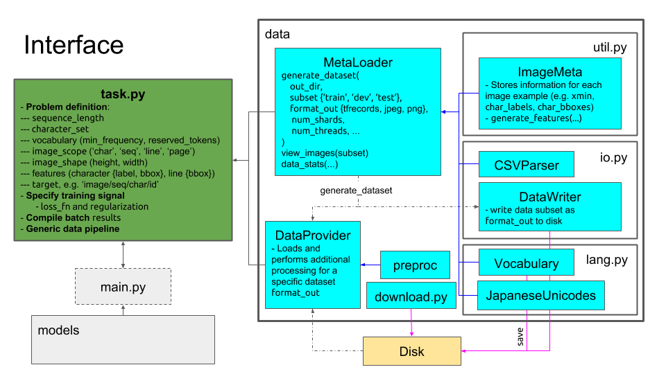

*******************************
CarpeDM: Sieze the Data Manager
*******************************

.. image:: https://pypip.in/version/carpedm/badge.png
    :target: https://pypi.python.org/pypi/carpedm/
    :alt: Latest Version

.. image:: https://travis-ci.org/SimulatedANeal/carpedm.png
    :target: https://travis-ci.org/SimulatedANeal/carpedm
    :alt: Continuous Integration Testing

.. image:: https://pypip.in/license/carpedm/badge.png
    :target: https://pypi.python.org/pypi/carpedm/
    :alt: License

.. image:: https://readthedocs.org/projects/carpedm/badge/
    :target: http://carpedm.readthedocs.io/en/latest/
    :alt: Docs

`Docs <http://carpedm.readthedocs.io/en/latest/>`_
| `Install Guide <http://carpedm.readthedocs.io/en/latest/install.html>`_
| `Tutorial <http://carpedm.readthedocs.io/en/latest/guides/usage.html>`_

Description
===========
*CarpeDM* is a general library for downloading, viewing, and manipulating image data.
Originally developed as a ChARacter shaPE Data Manager, CarpeDM aims to make Japanese character shape (字形) data
and other image datasets more accessible to machine learning researchers.

.. csv-table:: Datasets Currently Available for Download
    :header: "ID", "Dataset"
    :widths: 10, 80

    "pmjtc", "| `Pre-Modern Japanese Text Character Shapes Dataset (日本古典籍字形データセット) <http://codh.rois.ac.jp/char-shape/>`_,
    | provided by the Center for Open Data in the Humanities (CODH)."

Though still in the early stages of development, a high-level interface is also provided
for (1) automatic model-ready data generation and (2) flexible training of models with a variety of
deep learning frameworks.

Currently supported deep learning frameworks:

* `TensorFlow <https://www.tensorflow.org/>`_

Installation
============
To install **CarpeDM** use `pip`::

    $ pip install carpedm

See the installation `guide <http://carpedm.readthedocs.io/en/latest/install.html>`_ for more details.

Overview
========
A brief overview of the **CarpeDM** interface is given below.

For a complete guide on usage and available functionality, please refer to the `documentation`_

Using Your Data
===============
If you would like to use **CarpeDM** with your data, please follow the directory structure of the
`sample dataset <carpedm/data/small>`_. The current version of *CarpeDM* supports CSV files that follow the naming scheme
and format `here <carpedm/data/small/200003076/200003076_coordinate.csv>`_, for example.

Contributing
============
Contributions are welcome! Please see the `contribution guide`_

Versioning
==========
We use `SemVer <http://semver.org/>`_ for versioning. For the versions available,
see the `tags on this repository <https://github.com/SimulatedANeal/carpedm/tags>`_.

License
=======
This project is licensed under the MIT License - see the `LICENSE <LICENSE>`_ file for details.

Acknowledgments
===============

* This project was developed, in part, during an internship at the `National Institute of Informatics <https://www.nii.ac.jp/en/>`_, Tokyo.

.. _documentation: http://carpedm.readthedocs.io/en/latest/index.html
.. _contribution guide: http://carpedm.readthedocs.io/en/latest/contribution.html
